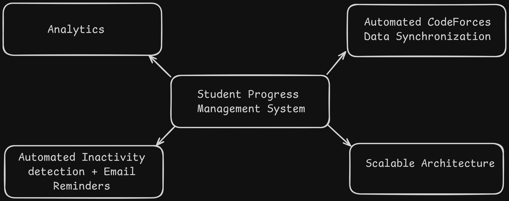
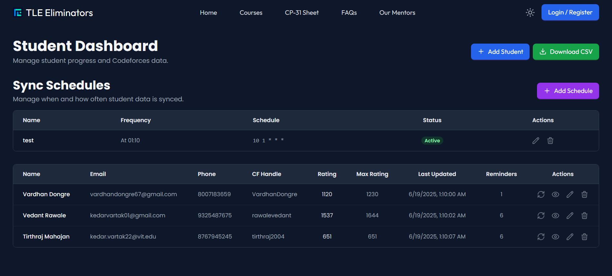
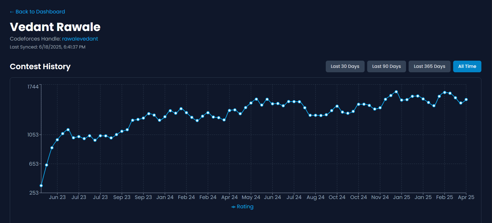
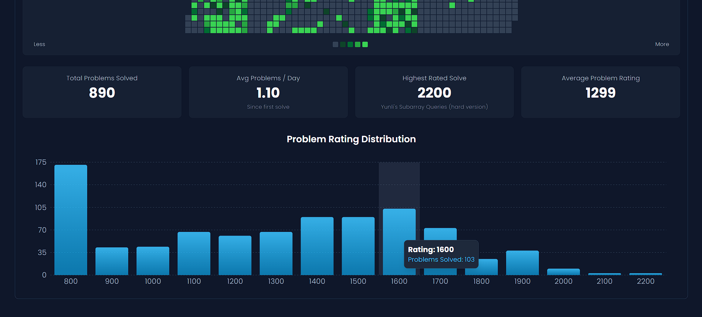
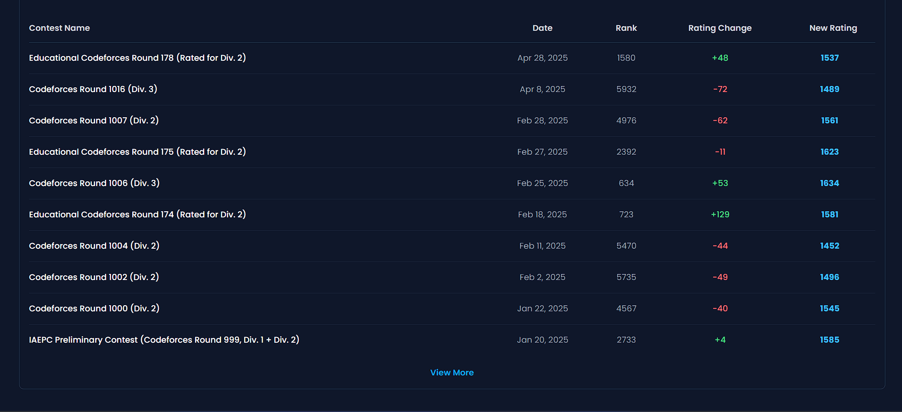
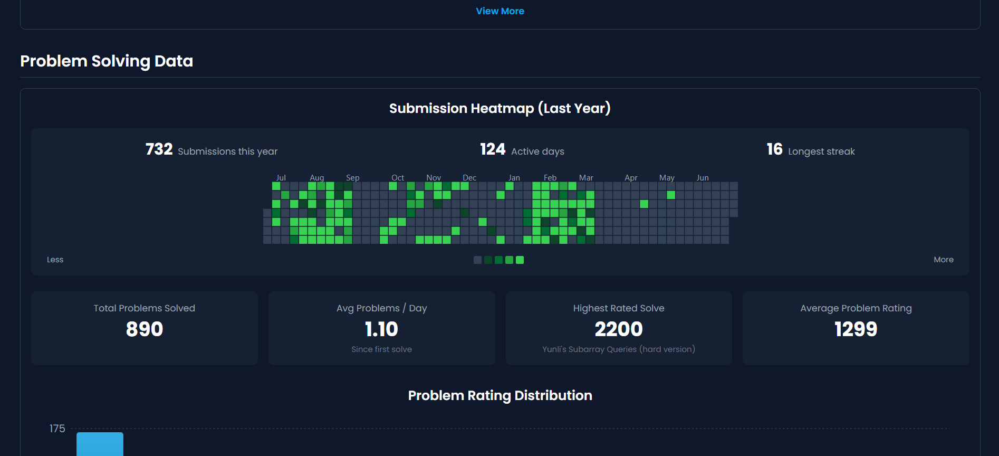
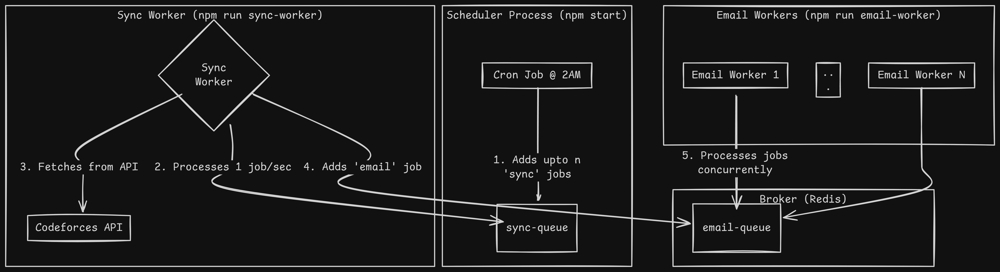

# Student Progress Management System

This is a full-stack MERN application for the position of full stack web developer at TLE Eliminators - https://www.tle-eliminators.com. The application includes a dashboard that stores data in MongoDB, while fetching a user's codeforces data once each day(2am) while also allowing to manually fetch whenever needed. 

## Technology Stack

| Category             | Technologies                               |
| :------------------- | :----------------------------------------- |
| **Frontend**         | React, React Router, Tailwind CSS          |
| **Backend**          | Node.js, Express.js                        |
| **Database**         | MongoDB                                    |
| **Job Queue System** | BullMQ, Redis                              |
| **Task Scheduling**  | node-cron                                  |
| **API Communication**| Axios                                      |
| **Utilities**        | date-fns                                   |

## This solution includes

*   **Student Management Dashboard:** The core of the frontend is a clean and responsive dashboard built with React. It provides full CRUD (Create, Read, Update, Delete) functionality for student profiles, allowing administrators to easily manage the roster of students being tracked.

  

*   **Automated Codeforces Data Synchronization:** The system automatically fetches comprehensive data for each student from the Codeforces API once each day (2am) or when user manually selects to fetch updated data from the API.

*   **In-Depth Performance Analytics:** For each student, the application generates and displays -
1. Most difficult problem solved (by rating)
2. Total problems solved
3. Average rating
4. Average problems per day
5. Bar chart of number of problems solved per rating bucket
6. Show a submission heat map

*   **Automated Inactivity Detection and Email Reminders:** The system  identifies students who have not made any submissions on Codeforces for a predefined period (seven days). Upon detection, it automatically triggers a job to send a polite, encouraging reminder email to the student. 

## The Scalability Architecture: From Monolith to Distributed Queues

This solution is scalable as well, the backend was architected as a distributed system using a Producer/Consumer pattern, orchestrated by specialized job queues. This design ensures efficiency, resilience, and true scalability.

### The Components of the System

1.  **The Scheduler (Producer):** A lightweight cron job serves as the system's main producer. Its sole responsibility is to trigger once every 24 hours. When it runs, it queries the database for the list of all students and, for each student, enqueues a `sync-student` job into a dedicated queue. 

2.  **The Broker (BullMQ and Redis):** The system uses BullMQ, a job queue library built on top of Redis. Redis acts as the high-speed message broker that stores the jobs. This decouples the scheduler from the workers that perform the actual tasks. Jobs are persisted in Redis, ensuring that even if a worker process crashes, the tasks are not lost and can be retried. The system utilizes two distinct queues: `sync-queue` for data fetching and `email-queue` for sending notifications.

3.  **The Sync Worker:** This is the first and most critical consumer in the chain. It is a dedicated Node.js process that listens exclusively to the `sync-queue`. Its job is to process student data synchronization tasks. To respect the Codeforces API limits and act as a responsible client, this worker is intentionally **rate-limited**. It will process only one job every few seconds. Its workflow is to:
    *   Dequeue a `sync-student` job.
    *   Make a single, data-rich API call to the Codeforces `user.status` endpoint.
    *   Process the returned submission history to calculate all necessary analytics.
    *   Update the student's record in the MongoDB database with the fresh data.
    *   Upon successful completion, enqueue a *new* `check-inactivity` job for that student into the `email-queue`.

4.  **The Email Worker:** This is the second consumer in the chain, listening to the `email-queue`.It checks the student's last submission date against the current date. If the student is deemed inactive, it sends an email. Because these tasks are quick and independent, this worker is configured to process jobs **concurrently**, allowing it to clear the email queue very rapidly.

## API Endpoints

The backend exposes a RESTful API for managing students and sync schedules.

### Student Management (`/api/students`)

| Method | Endpoint               | Description                                                                                                   |
| :----- | :--------------------- | :------------------------------------------------------------------------------------------------------------ |
| `GET`  | `/`                    | Retrieves a list of all students.                                                                             |
| `GET`  | `/:id`                 | Retrieves a single student by their unique ID.                                                                |
| `POST` | `/`                    | Creates a new student. Expects a JSON body with `name`, `email`, and `codeforces_handle`.                       |
| `PUT`  | `/:id`                 | Updates a student's information. If the `codeforces_handle` is changed, it re-fetches data.                    |
| `DELETE`| `/:id`                 | Deletes a student from the database.                                                                          |
| `POST` | `/:id/sync`            | Manually triggers a data synchronization for a specific student from the Codeforces API.                      |

### Schedule Management (`/api/cron`)

| Method | Endpoint               | Description                                                                                                   |
| :----- | :--------------------- | :------------------------------------------------------------------------------------------------------------ |
| `GET`  | `/schedules`           | Retrieves all saved cron job schedules.                                                                       |
| `POST` | `/schedules`           | Creates a new cron job schedule. Expects `name` and `schedule` (cron pattern).                                |
| `PUT`  | `/schedules/:id`       | Updates an existing schedule by its ID. Can be used to change the name, pattern, or `isEnabled` status.       |
| `DELETE`| `/schedules/:id`       | Deletes a cron job schedule.                                                                                  |

